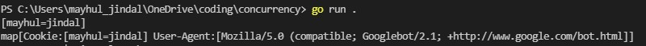
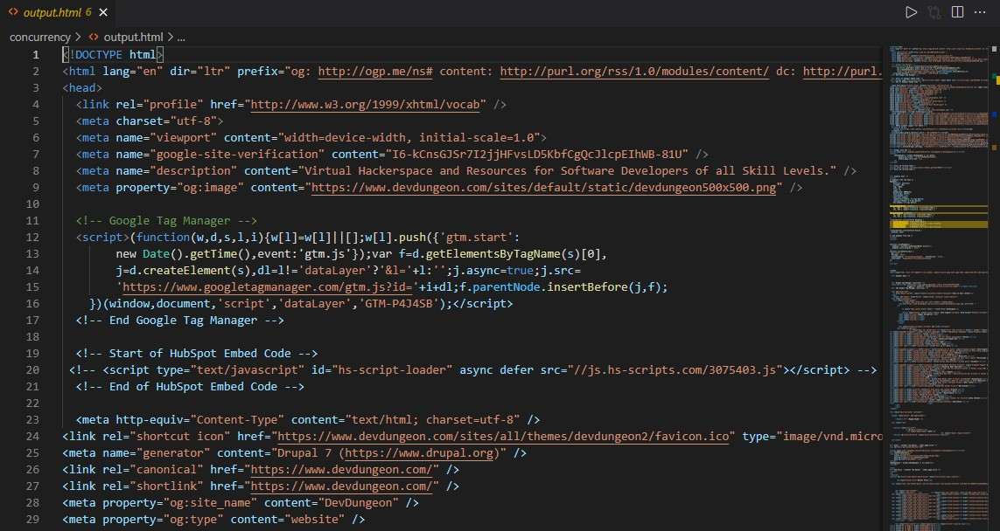
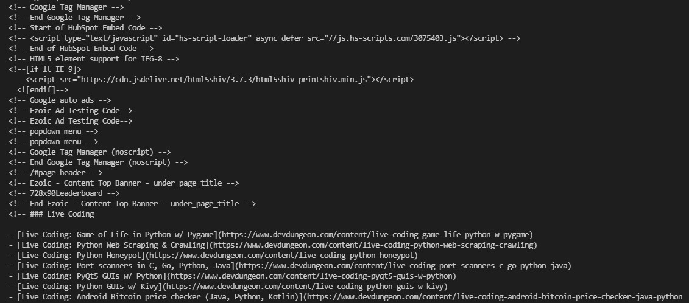
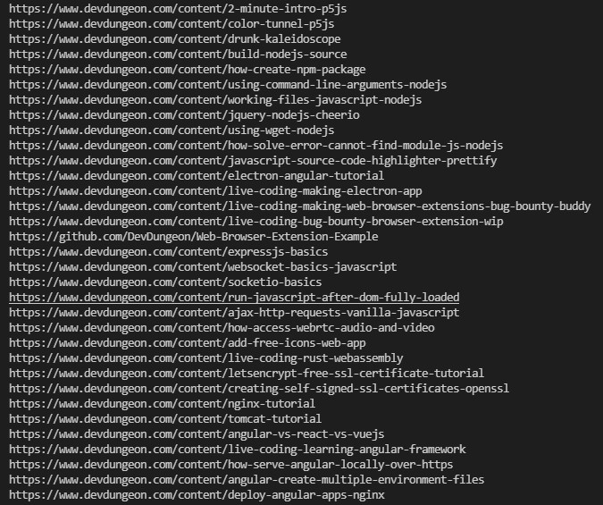
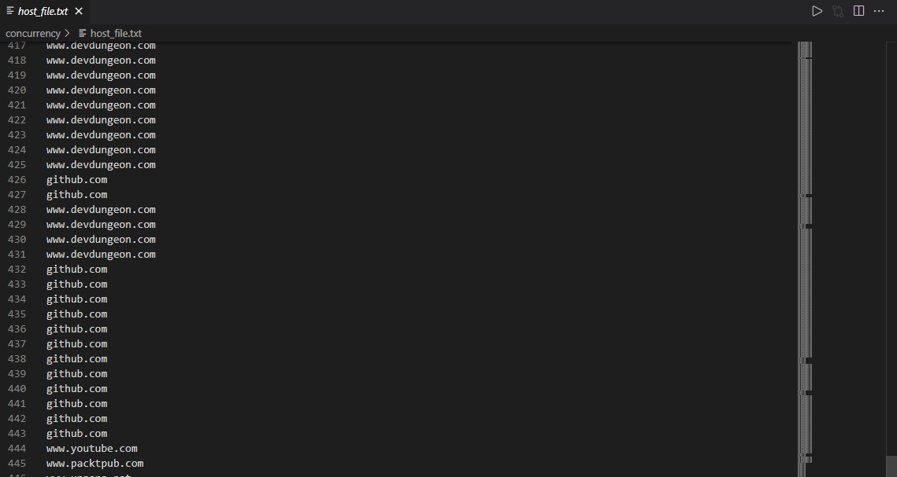

# **web_scrapper**

## Functionality

1. Login to the website, source code in login.go 
   
2. Custom cookie we made in the code following with the custom http header with our own user-agent because some sites may not allow the default one or they will ban it causing trouble
  

3. Saving the http response body in an output.html file

4. Title is scrapped from the output.html file using sub-string matching to find the element

5. Comments are scrapped from output.html file using regular expressions

6. Links from the page are scrapped using goquery

7. Parsing complex url to retrieve any one from protocol, authority, host name, port number, path, query, filename, and reference

